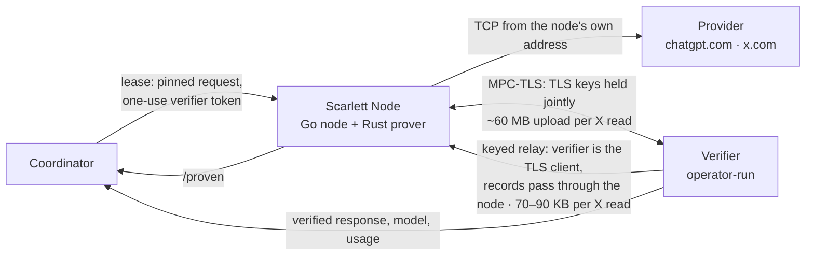

<p align="center">
  <picture>
    <source media="(prefers-color-scheme: dark)" srcset="docs/assets/logo-dark.svg">
    
  </picture>
</p>

<h1 align="center">Scarlett Node</h1>

<p align="center">
  A program you run at home, as a desktop app or a headless binary, that earns points on the Scarlett network<br>
  by proving with TLS proofs that an X read or a Codex run came straight from the provider, unaltered.
</p>

<p align="center">
  <a href="https://github.com/teslashibe/scarlett-node/actions/workflows/ci.yml"></a>
  <a href="https://github.com/teslashibe/scarlett-node/releases"></a>
  
  
  
</p>

<p align="center">
  <b><a href="docs/REFERENCE.md">Full technical reference</a></b> ·
  <a href="packaging/INSTALL.md">Install</a> ·
  <a href="desktop/README.md">Desktop app</a> ·
  <a href="api/node-v1.openapi.yaml">Wire API</a> ·
  <a href="api/x-request-catalog.json">X request catalog</a>
</p>

---

## What it is

Scarlett Node is the supplier client for the Scarlett network. You run it on a machine you own, with your own Codex login or X session, and it takes jobs from the network's coordinator: run one Codex request, or fetch one public X read (a search, a profile, a post, a thread). Instead of handing back a result and asking to be believed, the node produces a [TLSNotary](https://tlsnotary.org) proof that the bytes came from `chatgpt.com` or `x.com` in answer to exactly the request the job pinned. The coordinator reads the result from the verifier, not from the node.

The node is outbound-only. It polls the coordinator over HTTPS, opens no inbound port and holds no wallet key. The heartbeat is a long poll: each one asks the coordinator to hold it for up to 20 seconds and is answered the moment a job for this node is funded, so new work reaches an idle node in about one round trip; the node heartbeats again immediately after any answer and pauses only after a failed heartbeat (from one second, doubling to fifteen, with jitter) or when the coordinator asks with `Retry-After`. Provider credentials stay in private files on your machine and reach the Rust proof helper over stdin, never as command arguments or coordinator fields. Only the values of your login token or session cookies are hidden inside the proof; the request and the whole response are revealed to the verifier.

This is an early, runnable protocol proposal. Suppliers earn points only. The coordinator must implement [`api/node-v1.openapi.yaml`](api/node-v1.openapi.yaml), and paid dispatch and the reconciliation contract are not yet enabled there. Provider subscription terms, and permission to relay paid inference, are separate from this code and must be checked before serving real jobs. Everything below is a summary; the dense, authoritative version is [`docs/REFERENCE.md`](docs/REFERENCE.md).

## How it works



1. The node heartbeats to the coordinator and may receive a lease. A lease pins the exact request (a Codex `response.create` payload, or an X GraphQL read with its operation, query ID, variables and features) and carries a single-use verifier token.
2. The node opens the TCP connection to the provider from its own address and runs the request through the `scarlett-prover` helper with the verifier on the other side of a TLSNotary session.
3. The verifier checks the proven request against the job, records the full provider response, and the node posts `/proven`. The node never submits the answer itself.
4. The coordinator reads model, output and usage (Codex) or the verified response (X) from the verifier and settles separately. A stored proof is not a paid receipt.

For X there are two ways to run step 2. **MPC-TLS** is the standard TLSNotary mode: node and verifier hold the TLS keys jointly, so the verifier can neither read the hidden cookie values nor change what is sent. **Keyed relay** is a lighter mode in which the verifier is the TLS client and holds the session keys, while the node still owns the TCP connection and adds its hidden cookie bits to the one request record. Relay cuts a node's upload per read by roughly three orders of magnitude, and it is on by default; the trade is spelled out under [Security and trust model](#security-and-trust-model).

## Features

<table>
  <tr>
    <td width="33%" valign="top">
      <b>Proven, not asserted</b><br>
      Every Codex run and X read carries a TLSNotary proof that the response is exactly what the provider returned to exactly the request the job pinned.
    </td>
    <td width="33%" valign="top">
      <b>Credentials stay home</b><br>
      Codex logins and X sessions live in private local files, reach the prover over stdin, and are hidden inside the proof. Nothing is sent to the coordinator.
    </td>
    <td width="33%" valign="top">
      <b>Outbound only</b><br>
      HTTPS polling to the coordinator. No inbound port, no wallet key, and no gateway or verifier address ever comes from a job.
    </td>
  </tr>
  <tr>
    <td width="33%" valign="top">
      <b>Durable attempts</b><br>
      An exclusive journal commits each lease before the provider call and persists the result before submission. A crash or redelivery never reruns paid work.
    </td>
    <td width="33%" valign="top">
      <b>Multiple accounts</b><br>
      Up to eight Codex and eight X accounts per node, fair rotation, and per-account cooldowns that survive restart.
    </td>
    <td width="33%" valign="top">
      <b>Desktop or headless</b><br>
      A Tauri desktop app with a menu-bar/tray supervisor for macOS and Windows, or a single binary with a systemd user unit on Linux.
    </td>
  </tr>
  <tr>
    <td width="33%" valign="top">
      <b>Two X proof modes</b><br>
      MPC-TLS or keyed relay per job. Relay brings node upload per read from about 60 MB down to under 100 KB.
    </td>
    <td width="33%" valign="top">
      <b>Drain, upgrade, resume</b><br>
      Stop taking new work, let accepted jobs finish, swap the binary, resume. Identity and journal are preserved across upgrades and rollbacks.
    </td>
    <td width="33%" valign="top">
      <b>Pinned supply chain</b><br>
      Pinned x-go runtime snapshot, pinned tlsn fork, pinned open-agent-api release, and checksummed native bundles.
    </td>
  </tr>
</table>

## Quick start

### Desktop

Desktop builds are not yet published. Release installers are signed with Scarlett's own pinned self-signed certificates, so they are not notarized by Apple and Windows shows an unknown publisher; see [release signing](desktop/README.md#release-signing). The Mac development app is unsigned and is not a community release, and the Windows installer remains a release gate. To run it from source you need Node 26, Rust 1.95 and the Tauri prerequisites; see [`desktop/README.md`](desktop/README.md#build).

### Headless

Bundles ship the Go node, the pinned Rust proof helper, the Codex templates and a Linux user-service template. Supported targets are Linux amd64 on Ubuntu 24.04, macOS arm64 and macOS amd64. Full steps, including upgrade and rollback, are in [`packaging/INSTALL.md`](packaging/INSTALL.md).

1. Download the bundle for your platform and its checksum from the reviewed repository release or CI artifact, then verify it.

   ```sh
   sha256sum -c BUNDLE.tar.gz.sha256        # Linux
   shasum -a 256 -c BUNDLE.tar.gz.sha256    # macOS
   ```

2. Extract the archive, enter its directory and install. This places a version under `~/.local/lib/scarlett-node/versions/` and links both executables from `~/.local/bin/`.

   ```sh
   ./install.sh
   ```

3. Copy [`node.env.example`](packaging/node.env.example) to `~/.config/scarlett-node/node.env`, keep it at mode 0600, and set your services, absolute credential paths, and coordinator and verifier addresses.

4. Export those settings in a shell, pair once with a one-time code from the coordinator, then run.

   ```sh
   scarlett-node pair    # hidden prompt; keep the code out of arguments and history
   scarlett-node run
   ```

5. On Linux, run it as a user service instead of in the foreground.

   ```sh
   systemctl --user daemon-reload
   systemctl --user enable --now scarlett-node
   ```

### From source

```sh
go build -o scarlett-node .
cargo build --release --manifest-path prover/Cargo.toml
```

## Services

Set `SCARLETT_EXECUTOR=services` and choose `SCARLETT_SERVICES=codex`, `x_read` or `codex,x_read`. This is the only mode that uses proven execution for both providers.

### Codex

The lease carries the exact Codex `response.create` payload. The node runs `scarlett-prover prove` against the verifier, hides only its Codex login token, proves the transcript came from `chatgpt.com`, and posts `/proven`. Nodes advertise the reviewed base-model catalog in [`internal/config/codex-model-catalog.json`](internal/config/codex-model-catalog.json). Proven execution accepts exact base IDs with low reasoning and the default service tier; tools, instruction overrides, reasoning or service-tier changes and retained responses are rejected. Claude execution is unavailable in this binary.

### X reads

The node serves four public reads, the ones published in [`api/x-request-catalog.json`](api/x-request-catalog.json):

| Read | Operation | Scope |
| --- | --- | --- |
| Search | `SearchTimeline` | Latest, 1–20 items, 1–3 exact pages following the previous verified cursor |
| Profile | `UserByScreenName` | One profile by handle |
| Post | `TweetResultByRestId` | One post by ID |
| Thread | `TweetDetail` | One thread response, not a guarantee of the whole conversation |

The coordinator constructs the request; buyers cannot supply URLs, query IDs, feature flags, extra variables or an initial cursor. Only the values of the `auth_token`, `ct0` and `kdt` cookies and of `X-Csrf-Token` are hidden. Writes, other `x.com/i/api/` requests, other hosts and hidden response bytes are refused. Results are what X showed the node's account at that moment; the proof does not show that X returned everything that exists.

### X proof modes

| | MPC-TLS | Keyed relay |
| --- | --- | --- |
| Helper | `scarlett-prover prove-x` | `scarlett-prover relay-x` |
| Who holds the TLS keys | Node and verifier jointly | The verifier only |
| Verifier can learn hidden values | No | Yes, if dishonest or compromised (see below) |
| Verifier decides what is sent | No | Yes, one request per session |
| Node upload per read | 60–62 MB measured | 68–89 KB measured, growing with the response |
| Reads allowed | Typed jobs use the four catalog reads; the transport allows 14 | Only the four catalog reads; the verifier refuses others |
| Default | Always served | On; `SCARLETT_X_RELAY=0` turns it off |

Other executors exist for fixtures and earlier modes (`gateway`, `codex`, `codex-tlsn`); they are documented in the [reference](docs/REFERENCE.md).

**Warm X clients.** The node keeps one x-go client per X account, built at start and kept across jobs, so a job on a warm account does only its proven reads: x-go's two session-validation reads and two transaction-ID bootstrap fetches, which used to run unproven before every job (about 12 s around a 2 s proof), happen once per account. Each job's pinned exchanges and verifier token travel in its own request context, never in the shared client, and an X API request without a job behind it is refused. `x_read` reports `ready` once a client has validated the session against X, `configured` while one is still being built (or, for up to 15 seconds, after a rest ended or the session file was rewritten), and `auth_required`, `exhausted` or `unreachable` when the build failed, so a job is not needed to find out. The client is replaced in the background when the session file changes or X refuses the session, and a background refresh (`SCARLETT_X_REFRESH_SECONDS`, default 30 minutes) renews its transaction-ID material and asks X once whether the session still holds, without touching the jobs in flight. A check every 15 seconds builds a client for any account that has none (a new account, a new session file, a build that failed earlier) and drops the clients of removed accounts; a job builds a client itself only as a last resort. Details in the [reference](docs/REFERENCE.md).

## Security and trust model

**What a proof shows.** The response is exactly what the provider returned to exactly the request the job pinned. It does not show that the supplier's machine is honest, that a subscription is unused, or that X returned everything that exists. It is not on-chain settlement.

**MPC-TLS.** The node's own connection and IP reach `x.com` while the verifier jointly holds the TLS keys. The verifier can neither read the account's hidden values nor change what is sent.

**Keyed relay.** The node still opens the TCP connection, but the verifier is the TLS client and the only party holding the session keys. It decides what is sealed and sent with the node's real cookie and CSRF values. A node serving relay is therefore trusting its verifier with its X account. A dishonest or compromised verifier can make the node send one request of its own choosing per session as that account, read the answer, and learn chosen hidden bits from whether X accepts a distorted record; with the node's traffic to X it could read the values outright. The node cannot prevent this. It detects it afterwards: the verifier must open the request record once the response is complete, and the helper fails with `verifier misused this node's X session` if what it was made to send was not its own request, or if the verifier ended the session without opening the record. The node then logs one `ALERT keyed relay halted` line, stops listing relay in its heartbeat, declines relay offers, and keeps serving MPC-TLS. The halt is recorded in the node's state directory, so a restart does not re-arm relay; `scarlett-node status` shows `relay_halted` and `scarlett-node relay-resume` clears it once the operator has checked the verifier. Detection comes after the request has already been sent. With an honest verifier the account is used only for the four catalog reads; the verifier refuses a relay job for anything else, including the account's own feed and details.

Relay is on by default because every verifier is run by the network operator and the node already trusts it with its session. If you would rather not extend that trust, set `SCARLETT_X_RELAY=0` and the node serves MPC-TLS only. Either way, prefer an account kept for this purpose over a personal one. Keyed relay is new and has not yet been reviewed by an outside cryptographer.

**Verifier connection.** Both proof helpers encrypt the token and TLSNotary control traffic and verify the verifier's certificate and hostname against the pinned Mozilla roots (or `SCARLETT_VERIFIER_CA_FILE` for a private CA). There is no plaintext fallback, and the verifier address can only come from local configuration, never from a lease.

**Local state.** Pairing writes a private `identity.json` (0600) in a 0700 state directory. The journal stores no provider credentials, verifier tokens, prompts or complete leases. Account files, session files and `node.env` must stay private.

**Known gaps.** Committed job identities are not yet cryptographically verified against the Solana program. Usage limits are checked after inference rather than imposed as an upstream spending ceiling. Request headers other than `Host` are not pinned, so a dishonest node can hide short extra bytes inside a cookie value, up to its length limit. See the [reference](docs/REFERENCE.md) for the full list.

## Configuration

Settings come from the environment, typically via `~/.config/scarlett-node/node.env`; see [`packaging/node.env.example`](packaging/node.env.example). The most used variables:

| Variable | Meaning |
| --- | --- |
| `SCARLETT_COORDINATOR` | HTTPS origin of the coordinator the node polls |
| `SCARLETT_PROFILE` | Profile name sent when pairing and heartbeating |
| `SCARLETT_EXECUTOR` | Execution mode; `services` for proven community work |
| `SCARLETT_SERVICES` | Which services to serve: `codex`, `x_read` or both |
| `SCARLETT_VERIFIER` | `host:port` of the operator-run TLSNotary verifier |
| `SCARLETT_VERIFIER_CA_FILE` | Absolute PEM path for a private verifier CA; control connection only |
| `SCARLETT_COORDINATOR_CA_FILE` | Absolute PEM path adding roots for the coordinator transport only |
| `SCARLETT_PROVER` | Path to the `scarlett-prover` helper when it is not beside the node |
| `SCARLETT_CODEX_HOME` | Absolute Codex home holding a writable `auth.json` (single-account mode) |
| `SCARLETT_X_SESSION` | Absolute path to a private x-go session JSON file (single-account mode) |
| `SCARLETT_ACCOUNTS_FILE` | Absolute path of the multi-account registry, if not in the state directory |
| `SCARLETT_X_RELAY` | Serve X jobs proven by keyed relay; `0` serves MPC-TLS only |
| `SCARLETT_CODEX_CONCURRENCY` | Total simultaneous Codex jobs across accounts |
| `SCARLETT_X_CONCURRENCY` | Total simultaneous X jobs across accounts |
| `SCARLETT_X_ACCOUNT_CONCURRENCY` | Optional ceiling per authenticated X account, 1–32; CLI default 32 retains the registry limit, desktop sets 1 |
| `SCARLETT_X_REFRESH_SECONDS` | How often each warm X client refreshes its transaction-ID material and re-checks its session with X in the background (default 1800) |
| `SCARLETT_STATE_DIR` | Private directory for identity, journal and account health |
| `SCARLETT_BID` | Standing assignment bid; lower wins |
| `SCARLETT_INFERENCE_TIMEOUT_SECONDS` | Per-job Codex/gateway deadline, and the bound on one X request or client build; an x_read job runs to its lease deadline less 15 s |
| `SCARLETT_MAX_INPUT_BYTES` | Largest prompt or serialized X request the node accepts |
| `SCARLETT_MAX_OUTPUT_TOKENS` | Largest Codex completion the node accepts |
| `SCARLETT_JOURNAL_MAX_RECORDS` | Ceiling on unfinished journal attempts; a full journal refuses new work. Finished receipts do not count |
| `SCARLETT_JOURNAL_MAX_RECORD_BYTES` | Largest single journal record |
| `SCARLETT_JOURNAL_MAX_TOTAL_BYTES` | Space reserved for unfinished attempts |
| `SCARLETT_JOURNAL_MAX_TERMINAL_RECORDS` | Finished receipts kept for replay protection; the oldest are removed early beyond it |
| `SCARLETT_JOURNAL_MAX_TERMINAL_BYTES` | Space for finished receipts |

Defaults, ranges and the verifier-host variables are in the [reference](docs/REFERENCE.md).

### Everyday commands

```sh
scarlett-node status                       # private local JSON observation
scarlett-node drain                        # stop taking work; persists across restarts
scarlett-node resume
scarlett-node relay-resume                 # clear a keyed-relay halt after checking the verifier
scarlett-node accounts add codex work /absolute/private/codex-home 1
scarlett-node accounts add x_read research /absolute/private/x-session.json 1
scarlett-node accounts list
scarlett-node accounts reconnect x_read research   # replace an expired X session; cookie JSON on stdin
scarlett-node accounts login-x research 1        # browser login with hidden prompts and verification code
scarlett-node accounts login-x research 1 reconnect # verify saved session first, then recover if expired
```

## Development

Go module `github.com/teslashibe/scarlett-node` on Go 1.25; the Rust proof helper in `prover/` pins Rust 1.95 through `prover/rust-toolchain.toml`.

```sh
go build ./...
go vet ./...
go test ./...

cd prover && cargo test
```

CI ([`ci.yml`](.github/workflows/ci.yml)) runs `gofmt` over first-party Go files, `go build`, `go vet`, `go test -race ./...` and `cargo test --locked`. The gateway is used only through the public `github.com/teslashibe/open-agent-api/pkg/codex` package at a pinned release; `third_party/x-go` is a pinned snapshot with source hashes in `UPSTREAM.json`.

The live X check is opt-in and uses a real X session, calling read methods only:

```sh
go test -tags xlive -run TestXLive ./internal/worker
```

It needs the environment variables listed in `internal/worker/xlive_test.go`. Other entry points: `scripts/package.sh VERSION` builds a checksummed native bundle, the `Dockerfile` builds the image used by the unpaid Docker fixture, and the desktop app has its own build steps in [`desktop/README.md`](desktop/README.md). Windows runtime notes are in [`docs/WINDOWS-RUNTIME.md`](docs/WINDOWS-RUNTIME.md).

## Contributing and security reporting

There is no separate contributing guide or security policy yet. Open an [issue](https://github.com/teslashibe/scarlett-node/issues) for bugs, questions and security reports. Pull requests must keep `go build ./...` and `go test ./...` passing, keep the `node-v1` wire schema and fixtures aligned with the Go structs, and never log secrets or weaken deadline and fence protections.

---

<p align="center">
  <sub>
    <a href="docs/REFERENCE.md">Technical reference</a> ·
    <a href="packaging/INSTALL.md">Install</a> ·
    <a href="desktop/README.md">Desktop</a> ·
    <a href="api/node-v1.openapi.yaml">node-v1 wire API</a> ·
    <a href="api/x-request-catalog.json">X request catalog</a> ·
    <a href="https://github.com/teslashibe/scarlett-node/issues/1">Roadmap gaps (issue #1)</a>
  </sub>
</p>

### Interactive X login

The desktop Sign in to X form and `accounts login-x ID CONCURRENCY` use a local browser helper. Enter the X username and password, then supply any verification code requested by X. There is no authenticator seed field. Passwords and codes stay in the active local operation; only a session verified through Go is saved. An existing account's session is kept when verification fails. New browser sessions save the verified X account ID in the canonical `twid` cookie field. Reconnect checks that ID when available; older imported cookies without it cannot establish historical identity, so replacement follows the operator's chosen local ID and verified username.

Use the reconnect checkbox or the final `reconnect` CLI argument for an existing local account. Reconnect first checks its saved session and retains its proxy. Browser profiles persist on this device; pending challenges expire after at most four minutes. Cancel, close the app or restart the helper to discard a pending login. Restarted challenges require a new login. A cooldown or transient failure does not trigger another password submission.

See [local browser runtime packaging](docs/x-browser-runtime.md) for supported Chrome installations, packaged native resources and the Docker companion service. Builds without that runtime still support browser-profile import and cookie paste.

For trusted native automation, `accounts login-x` without arguments uses protected JSON-lines stdin. Keep the owner pipe open for the conversation; send `start` with account ID, concurrency, username and password, then `continue` with the returned challenge ID and code, or `cancel` with the matching account ID. Never place credentials in arguments, scripts, logs or coordinator payloads. Pending output contains only account and challenge presentation fields.

Offline fixtures cover the operation lifecycle and account replacement. They do not establish live X access; a release smoke test must separately verify login, code continuation and subsequent session reuse on each supported platform.

## X readiness and pacing

Each verified X identity has one execution lane and a shared local quota domain. Adding another session for the same X identity does not add capacity. Reusing an identity on another node does not create independent provider quota; these checks currently cover one node.

Heartbeats report the physical configured ceiling separately from current runnable capacity. Managed accounts expose bounded aggregate account counts and readiness for search, profile, post and thread. Operation capacities overlap and must never be added together. A known eligibility deadline wakes the held heartbeat at that deadline; dispatch still checks the selected identity and session before accepting the immutable request. Inherited unresolved X journals hold X admission until reconciliation because those records cannot prove their original account identity.

`SCARLETT_X_PACING_MODE` defaults to `conservative`, which spreads requests through the observed provider window. The opt-in `quota_budget` mode uses the configured minimum gap while complete, unexpired headers for that operation show remaining quota above a twenty-percent reserve, with a minimum reserve of two requests. Every authenticated dispatch, including validation and pagination, debits the shared budget under the pacing mutex. Stale or concurrent headers cannot replenish an active window. A later page can wait when the preceding page reaches the reserve; the buyer page count does not reserve provider quota in advance.

Authoritative reset headers permit a cooldown until reset plus 50 milliseconds. Unknown rate-limit denials retain the fifteen-minute fallback. Positive bounded jitter is added after the fixed gap or quota floor. Private diagnostics separate fixed-gap, jitter, voluntary spread and reset waits and retain bounded numeric quota snapshots with observation, capture and next-eligibility timestamps. The compatibility aggregate wait phases overlap the detailed phases and must not be summed with them. Quota observations are in-memory scheduling evidence, so a process restart requires fresh headers before burst eligibility can resume.

The node always sends the full heartbeat shape. A heartbeat the coordinator rejects (400, or 413 above 32 KiB) is logged and backed off like any other failed heartbeat; the node no longer falls back to the older generic shape. Rolling back the node preserves account and journal safeguards; older diagnostic readers may discard the newer optional local telemetry history.
